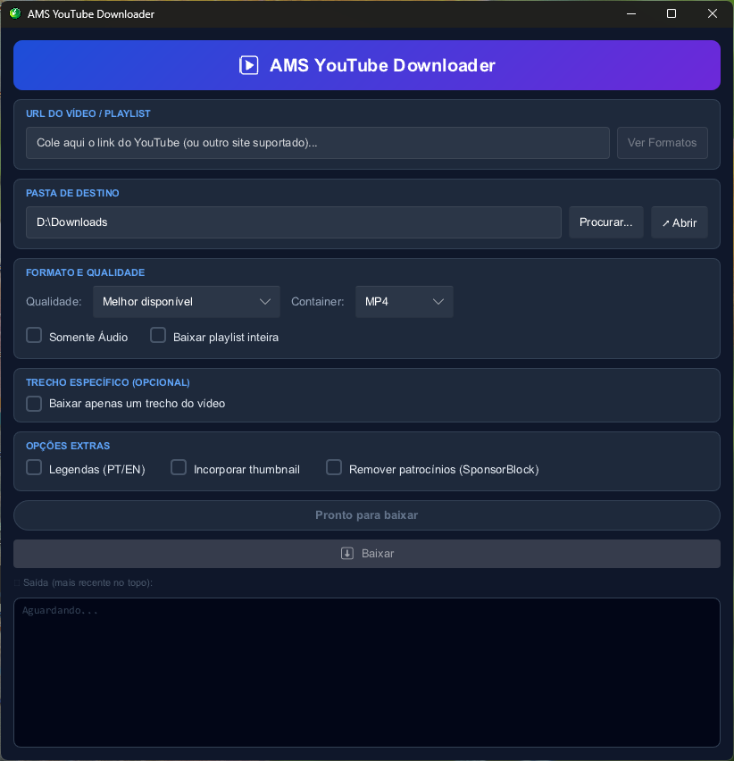
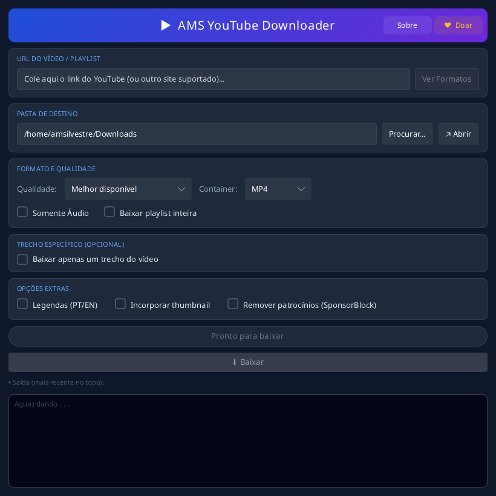

# AMS YouTube Downloader

> Interface gráfica para o **yt-dlp** — baixe vídeos e áudios do YouTube (e centenas de outros sites) com facilidade.

Desenvolvido em **Rust** com interface **Slint**. Roda em **Windows** e **Linux**.

---

## Funcionalidades

- **Cole o link** de qualquer vídeo ou playlist do YouTube
- **Escolha a qualidade**: Melhor disponível, 4K, 1080p, 720p, 480p, 360p ou menor tamanho
- **Escolha o container**: Auto, MP4, MKV ou WebM
- **Somente áudio**: extrai em MP3, M4A, OGG, WAV ou FLAC
- **Baixar playlist inteira** com numeração automática
- **Trecho específico**: define horário de início e fim (HH:MM:SS)
- **Legendas**: baixa e incorpora legendas em PT e EN
- **Thumbnail**: incorpora a capa do vídeo no arquivo
- **SponsorBlock**: remove automaticamente patrocínios, intros e outros segmentos
- **Log em tempo real**: acompanhe o progresso e a saída do yt-dlp
- **Pasta de destino** configurável com atalho para abrir no Explorer

---

## Capturas de tela

| Windows | Linux |
|---|---|
|  |  |

---

## Instalação

### Windows

Baixe o instalador `AMS_YT_Downloader_Setup_*.exe` da [página de releases](../../releases).
Ele já inclui o `yt-dlp` e o `ffmpeg` — nada mais a fazer.

Se preferir o portátil (`AMS_YT_Downloader.exe`), coloque `yt-dlp.exe` e
`ffmpeg.exe` na mesma pasta ou no PATH.

### Linux (x86_64)

**Fedora / RHEL**
```bash
sudo dnf install ./ams-yt-dw-*.x86_64.rpm
```

**Debian / Ubuntu**
```bash
sudo apt install ./ams-yt-dw_*_amd64.deb
```

**Portátil (qualquer distro, sem root)**
```bash
tar -xzf AMS_YT_Downloader-*-linux-x86_64.tar.gz
cd AMS_YT_Downloader-*/
./install.sh          # instala em ~/.local; --uninstall remove
```

No Linux o `yt-dlp` e o `ffmpeg` **não vêm embutidos** — os pacotes os declaram
como dependência do sistema. Isso é proposital: o yt-dlp quebra sempre que o
YouTube muda, e assim ele continua recebendo atualização pela sua distro.

> Para uma versão do yt-dlp mais nova que a da distro: `pipx install yt-dlp`

---

## Requisitos

| Ferramenta | Obrigatório | Windows | Linux |
|---|---|---|---|
| `yt-dlp` | ✅ Sim | [releases](https://github.com/yt-dlp/yt-dlp/releases) (`yt-dlp.exe`) | pacote da distro ou `pipx install yt-dlp` |
| `ffmpeg` | ✅ Sim — mesclar formatos, converter áudio, recortar trecho | [ffmpeg.org](https://ffmpeg.org/download.html) | `ffmpeg` (Debian) / `ffmpeg-free` (Fedora) |
| Node.js | ⚠️ Recomendado | [nodejs.org](https://nodejs.org) | pacote `nodejs` |

No Windows as ferramentas podem ficar na **mesma pasta** do executável ou no
**PATH**; no Linux, no PATH (os pacotes já cuidam disso).

> **Nota:** sem o Node.js o yt-dlp ainda funciona, mas pode exibir um aviso sobre
> runtime JavaScript. O app detecta o Node.js automaticamente — e só passa a flag
> `--js-runtimes` se a sua versão do yt-dlp a suportar, para não quebrar com as
> versões mais antigas que costumam vir nos repositórios das distros.

---

## Como usar

1. Instale conforme a seção acima
2. Abra o **AMS YouTube Downloader** (menu de aplicativos, ou `ams-yt-dw` no terminal)
3. Cole o link do vídeo, configure as opções e clique em **Baixar**

---

## Como compilar

### Windows

- [Rust](https://rustup.rs) (stable, 1.75+)
- [Visual Studio Build Tools](https://visualstudio.microsoft.com/pt-br/visual-cpp-build-tools/)

```bash
cargo build --release
```

### Linux

A única dependência de sistema é o **fontconfig** — as bibliotecas de janela e
OpenGL (xkbcommon, Wayland, EGL) são carregadas via `dlopen` e não precisam de
pacote `-dev`.

```bash
# Fedora
sudo dnf install fontconfig-devel

# Debian / Ubuntu
sudo apt install build-essential pkg-config libfontconfig-dev

cargo build --release
```

O binário fica em `target/release/ams-yt-dw`.

### Gerar os pacotes Linux

```bash
cargo install cargo-deb cargo-generate-rpm

packaging/build-tarball.sh     # tarball portátil + install.sh
cargo deb                      # .deb
cargo generate-rpm             # .rpm
```

> O `build.rs` converte automaticamente o `assets/icon.ico` para
> `assets/icon_window.png` e, no Windows, embute o ícone no executável.

---

## Estrutura do projeto

```
AMS-Yt-dw/
├── src/
│   └── main.rs              # Lógica principal (Rust)
├── ui/
│   └── app.slint            # Interface gráfica (Slint)
├── assets/
│   └── icon.ico             # Ícone do aplicativo
├── installer/
│   └── setup.iss            # Instalador Windows (Inno Setup)
├── packaging/
│   ├── ams-yt-dw.desktop    # Entrada de menu (Linux)
│   └── build-tarball.sh     # Gera o tarball portátil
├── docs/
│   └── LINUX_PORT.md        # Registro do porte para Linux
├── build.rs                 # Script de build (ícone + Slint)
├── Cargo.toml
└── Cargo.lock
```

---

## Dependências principais

| Crate | Uso |
|---|---|
| [`slint`](https://slint.dev) | Framework de UI nativa |
| [`rfd`](https://crates.io/crates/rfd) | Diálogo de seleção de pasta |
| [`dirs`](https://crates.io/crates/dirs) | Pasta Downloads padrão do usuário |
| [`arboard`](https://crates.io/crates/arboard) | Área de transferência (chave Pix) |
| [`qrcode`](https://crates.io/crates/qrcode) | QR Code Pix |
| [`winresource`](https://crates.io/crates/winresource) | Embutir ícone no `.exe` (só Windows) |
| [`image`](https://crates.io/crates/image) | Converter ICO → PNG (build) |

---

## Créditos

- **yt-dlp** — [github.com/yt-dlp/yt-dlp](https://github.com/yt-dlp/yt-dlp)
- **FFmpeg** — [ffmpeg.org](https://ffmpeg.org)
- Ícone por **Hopstarter** (3D Cartoon Vol.2)

---

## Licença

MIT
